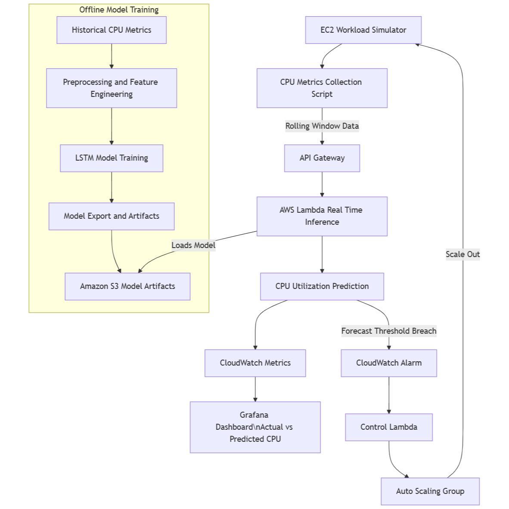

# AI-Driven-Cloud-Resource-Optimization-System
An end-to-end ML-powered cloud optimization pipeline that forecasts CPU workloads and automatically scales cloud resources using AWS services and predictive analytics.

### Workflow Diagram

#### Machine Learning Phase - 

**Primary Tools:** `VS Code` , `Google Colab`

* **Collection and Feature Engineering**
  
    + Data Collection - Collected from Kaggle (Bitbrains Dataset).
 
    + Data Preprocessing.
 
    + Normalization, Scaling, Creating Sequences

* **Model Training**

    + Used LSTM and XGBoost for Model Training.
 
    + XGBoost was used for baseline predictions.
 
    + LSTM was the primary model which used for deployment due to better performance.
 
    + LSTM model saved as a zip file along with its dependencies.

#### Cloud Deployment - 

**Services:** `AWS` , `Docker` , `Grafana`

* The saved model initially stored on S3 bucket.

* Later created a repository created in AWS **Elastic Container Registry** `[ECR]` for containerization which is done by **Docker** locally.

  #For login to ECR:
  '''
  aws ecr get-login-password --region <your-region> | docker login --username AWS --password-stdin <account-id>.dkr.ecr.us-east-1.amazonaws.com
  '''

